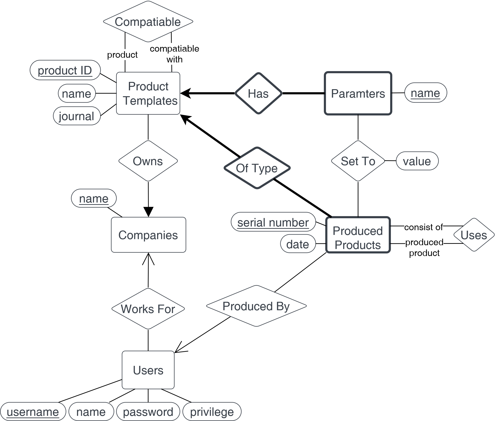

# Beskrivelse af eksisterende database

Det eksisterende database design ser ud som følger:: 

Som man kan se er der ingen relationer mellem de forskellige entety sets, hvilket er problematisk.

De forskellige entety sets er beskrevet som følger

- <b>Products</b>: De produkter som mechtronic har udviklet.
- <b>Devices</b>: De enheder som bliver produceret af et bestemt produkt. Den person som har produceret enheden gemmes i ProductEmployee. Den som ejer enheden gemmes i Owner.
- <b>Bugs</b>: Hvis et produkt har en fejl (fx en softwarefejl) - omhandler altså et produkt og ikke en specifik enhed
- <b>Users</b>: Alle brugere af systemet
- <b>Components</b>: De komponenter som mechtronic har udviklet. En komponent kan tilføjes til en produktenhed for at give ekstra funktionalitet. En komponent er kun kompatibel med nogle produkter - derfor ProductIDs.
- <b>Parameters</b>: En parameter for en komponent. Kan fx være WiFi indstillinger til et router-komponent.
- <b>Component</b>: En produceret komponentenhed som er sat på en bestemt produktenhed
- <b>ComponentParameter</b>: Parameterværdi for en komponent-parameter som er tilknyttet en specifik komponentenhed.
- <b>Service</b>: Når der laves service af en produktenhed, så skal der beskrives hvad der er lavet. Altså er den tilknyttet et DeviceID.

De sidste to entety sets ser ikke ud til at blive brugt, men tror meningen er som følger:

- <b>Serviceparts</b>: De forskellige typer af servicedele - fx LCD-display osv.
- <b>Servicepart</b>: En servicedel som er blevet brugt. Altså skal den være tilknyttet en "serviceparts" i form af Partnumber og en service i form af ServiceID.

## Analyse ud fra designprinciples:

Mange af principperne er selvfølgelig svære at analyser nu når der slet ikke er nogen relationer, for alt skal jo laves om.

<b>Faithfullness:</b> 
Umiddelbart fornuftigt ift. attrbutterne, da alle beskriver virkeligheden. Dog kan man tænke over følgende:

- Device har SoftwareVersion, men ikke alle har noget med software at gøre. Det er faktisk ikke et faithfullness problem, da den er optional.

<b>Avoiding Redundancy</b> 
Er galt flere steder. Fx products og Devices.

<b>Simplicity Counts</b> 
Parametre virker meget kompliceret.

<b>Choosing the Right Relationships</b> 
Der er ingen, så det kan kun blive bedre.

<b>Picking the Right Kind of Element</b>
Måske kan man fjerne entety sets og erstatte med attributes.

<b>Andet:</b> 

- Navnene giver ikke mening - fx devices.
- Kan ikke finde ud af, om det er smart at have et productID eller bare have name som primary key. Dog kan det måske være svært at ændre navnet efter, hvis den bruges som key.

## Spørgsmål

- Er en owner altid en user?
- Kan vi lave komponent om til produkt (bugs, service)
- Hvorfor skal man vide at de er kompatible?

# Final E/R diagram

